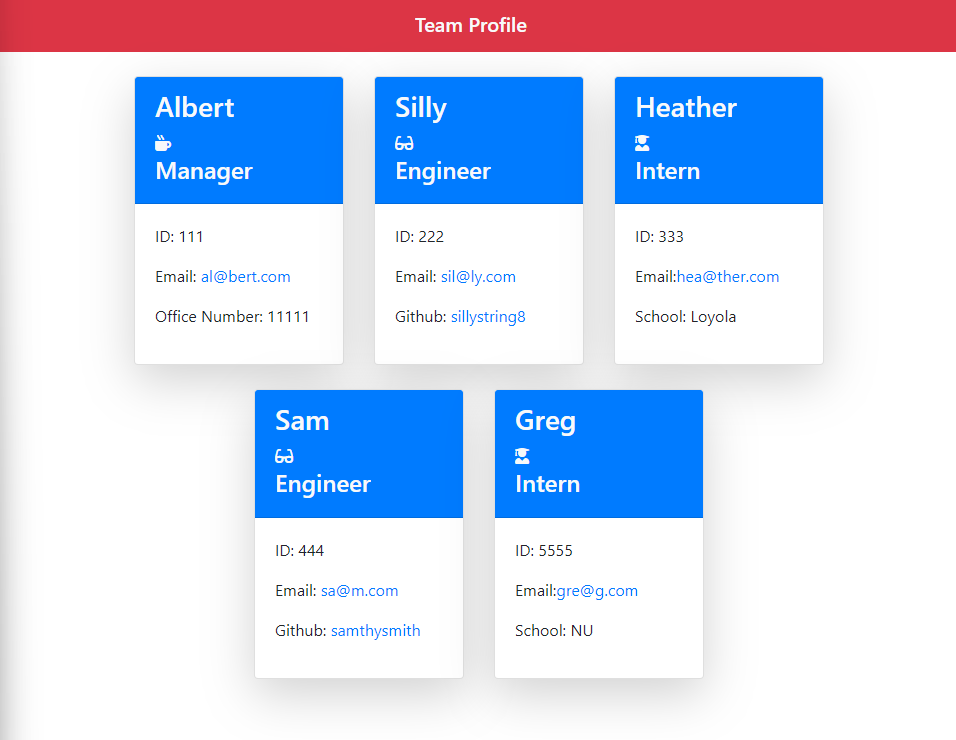
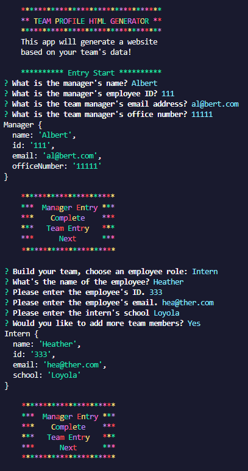

# Team Profile Generator

  
  
  ## Description
  
  ```md
AS A manager
I WANT to generate a webpage that displays my team's basic info
SO THAT I have quick access to their emails and GitHub profiles
```
  
  The challenge is to build a Node.js command-line app that takes in information and generates an HTML webpage with said data. The critical component of the project is the unit tests for the code. 

  The user requests an app that will generate a webpage that displays a team's basic information with quick access to their emails and Github profiles.

  I learned that unit testing is very difficult to write and will certainly be a challenge moving forward.
  
  ## Acceptance Criteria
  
  ```md
GIVEN a command-line application that accepts user input
WHEN I am prompted for my team members and their information
THEN an HTML file is generated that displays a nicely formatted team roster based on user input
WHEN I click on an email address in the HTML
THEN my default email program opens and populates the TO field of the email with the address
WHEN I click on the GitHub username
THEN that GitHub profile opens in a new tab
WHEN I start the application
THEN I am prompted to enter the team manager’s name, employee ID, email address, and office number
WHEN I enter the team manager’s name, employee ID, email address, and office number
THEN I am presented with a menu with the option to add an engineer or an intern or to finish building my team
WHEN I select the engineer option
THEN I am prompted to enter the engineer’s name, ID, email, and GitHub username, and I am taken back to the menu
WHEN I select the intern option
THEN I am prompted to enter the intern’s name, ID, email, and school, and I am taken back to the menu
WHEN I decide to finish building my team
THEN I exit the application, and the HTML is generated
```
  
  ## Table of Contents 
  
  - [Installation](#installation)
  - [Usage](#usage)
  - [License](#license)
  - [Contributing](#contributing)
  - [Tests](#tests)
  - [Questions](#questions)
  
  ## [Installation](#table-of-contents)
  
  In order to install this project, you must copy the repo and make sure to run all necessary dependencies as found in the main index.js. Such dependencies are Jest and Inquirer.
  
  ## [Usage](#table-of-contents)
  
  Run the index.js in your terminal of choice to complete the application. Then go to the Tests folder and run the jest tests to make sure they run correctly.
  
  What the terminal should look like:
  
  
  What the generated html looks like:
  
  
  Here's a link to a sample [video](https://drive.google.com/file/d/1HaXfg_0NSHkrzUejvV-MEMJxRmXXPkYH/view?usp=sharing).
     
  ## [Contributing](#table-of-contents)

  No further contributions.

  ## [Tests](#table-of-contents)
  
  Jest tests will be built for Employee, Engineer, Intern and Manager.
  
  ## [Questions](#table-of-contents)
  
  For additional questions, please reach out to:

  [GitHub: devilarms83](https://github.com/devilarms83)

  [Email: bautista.albert@gmail.com](mailto:bautista.albert@gmail.com)

